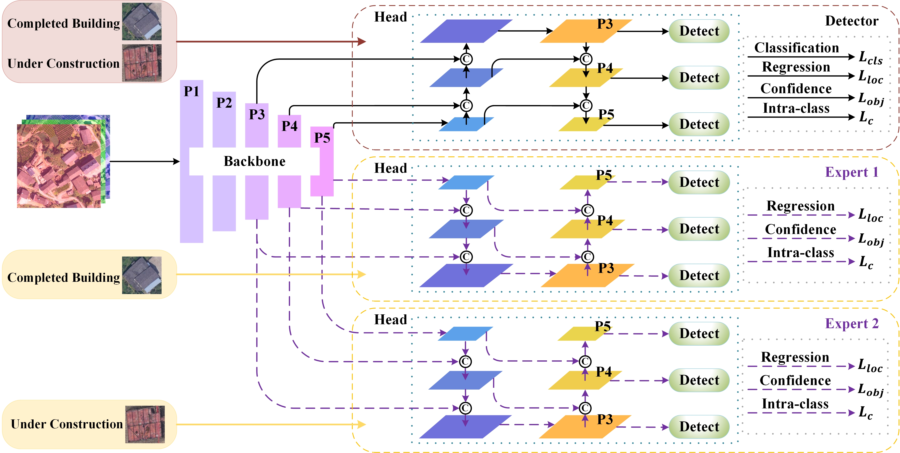

# MIAYOLO: Multi-Expert and Intra-Class Aggregation Assisted Suburban Building Detection in Unmanned Aerial Vehicle Imagery
⭐ This code has been completely released ⭐ 

<p align="center">  </p>

## Requirements

```python
pip install -r requirements.txt
```
## Train

### 1. Prepare training data 
- Download data for our experiment from [baiduyun](https://pan.baidu.com/s/1UIYu9GJKSF2g7H5M3Clg2Q) (code: zd59). And the path of dataset is like that

```python
MIAYOLO
├── dataset
│   ├── UCB
│   │   ├── train
│   │   │   ├── images
│   │   │   ├── labels
│   │   ├── val
│   │   │   ├── images
│   │   │   ├── labels
```
### 2. Begin to train
<!--
```python
python train.py --cfg models/MIAYOLO.yaml
```

new fusion method MF
-->
```python
python train.py --cfg models/MIAYOLO.yaml
```
## Test

### 1. Pretrained Checkpoints
You can use our pretrained checkpoints for test process.
Download pre-trained model and put it in [here](https://pan.baidu.com/s/1e6XtRCF7pIG1L2ECk2joRQ) (code: 97wj).
### 2. Begin to test
<!--
```python
python detect.py --weights weights/MIAYOLO.pt 
```

new fusion method MF
-->
```python
python detect.py --weights weights/MIAYOLO.pt 
```

## Acknowledgements
This code is built on [YOLOv5 (PyTorch)](https://github.com/ultralytics/yolov5). We thank the authors for sharing the codes.

